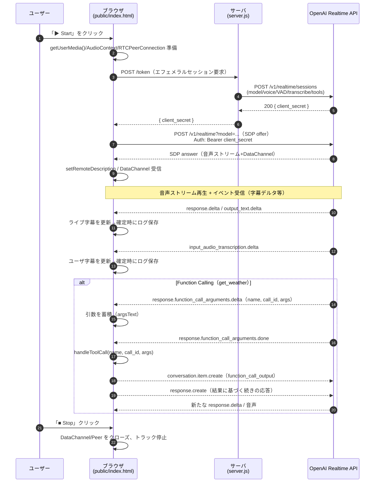
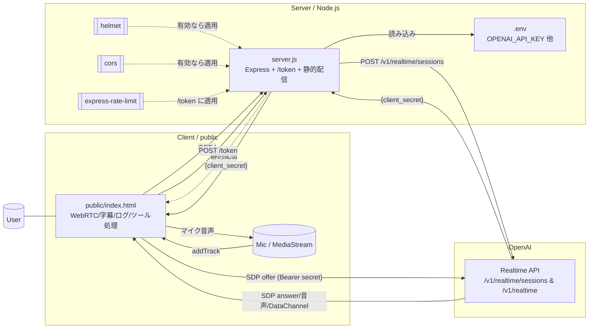

# Realtime Voice (WebRTC) + Function Calling Demo

ブラウザからマイク音声を WebRTC で OpenAI Realtime API に送り、AI の音声・テキスト返答をリアルタイムに受け取るデモです。字幕のライブ表示、確定ログの保存、簡易ツール呼び出し（Function Calling）を実装しています。

## 主な機能
- リアルタイム会話: マイク入力→AI 音声/テキストを同時受信、右ペインで字幕・ログ表示
- Function Calling: `get_weather` ツールを実装（ダミー値で応答）
- ログ管理: 会話履歴を `localStorage` に自動保存、JSON でエクスポート
- 音声アバター: 受信音声の簡易 VAD で「話している」アニメーション
- セッション発行: バックエンドが OpenAI へエフェメラルセッションを発行（API Key はクライアントに渡さない）

## ディレクトリ構成
- `server.js`: Express サーバ。`/token` で Realtime セッションを作成し、`public/` を静的配信
- `public/index.html`: Web クライアント。WebRTC 接続、字幕/ログ UI、ツール処理など
- `.env`: 環境変数（API キーなど）。`.gitignore` 済み

## 動作要件
- Node.js 18+（または 20+ 推奨）
- 最新ブラウザ（WebRTC とマイク権限が必要）
- OpenAI API Key（環境変数で設定）

## セットアップ
1) 依存関係をインストール

```bash
npm install
```

2) `.env` を作成し、少なくとも以下を設定

```env
OPENAI_API_KEY=sk-...   # あなたの API Key（公開・共有厳禁）
PORT=3000               # 任意。未設定なら 3000

# 省略可（未設定時は既定値）
REALTIME_MODEL=gpt-realtime        # 旧: gpt-4o-realtime-preview でも可
REALTIME_VOICE=alloy               # 音声ボイス
TRANSCRIBE_MODEL=gpt-4o-transcribe # 音声文字起こし
TURN_SILENCE_MS=700                # サーバ VAD の無音検出(ms)
CORS_ALLOW_ORIGIN=                 # 本番では許可ドメインをカンマ区切りで指定
```

3) サーバを起動

```bash
npm start
```

4) ブラウザでアクセス

```
http://localhost:3000
```

ページの「▶ Start」を押してマイク権限を許可すると会話を開始できます。右上「Export JSON」で会話履歴を保存できます。

## 仕組み（概要）
- バックエンド（`server.js`）
  - `POST /token`: OpenAI の `POST /v1/realtime/sessions` に対して、指定モデル・音声・VAD・文字起こし・Function Calling の設定をまとめて送信し、エフェメラルな `client_secret` を発行してクライアントへ返します。
  - `GET /healthz`: 簡単な疎通確認 (`{ ok: true, model: ... }`)。
  - 静的配信: `public/` 配下を配信。
- フロントエンド（`public/index.html`）
  - WebRTC: `RTCPeerConnection` を作成し、`/token` でもらった `client_secret` を使って OpenAI Realtime と SDP 交換。
  - DataChannel: Realtime から届くイベントを処理し、テキストのデルタ表示・確定ログ化を行います。
  - Function Calling: Realtime からの関数引数デルタを受け取り、`get_weather` を実行した結果を `function_call_output` として会話に注入した上で再応答を生成。
  - UI: ライブ字幕、ログ自動保存、JSON エクスポート、簡易 VAD 連動アバター。

## Function Calling をカスタマイズ
- サーバ側ツール定義: `server.js` の `/token` で `tools` に関数仕様（名前・引数）を定義します。
- クライアント実装: `public/index.html` の `handleToolCall(name, callId, args)` にツールの実処理を実装します。
  - 実運用ではクライアントから直接外部 API を叩かず、サーバ経由にするなどセキュリティ配慮を推奨。

## RAG（検索拡張生成）の最小実装
- 追加ツール: `search_kb`（引数: `query`, `top_k`）。モデルが必要に応じて呼び出します。
- サーバ: `POST /rag/search` で簡易キーワード検索を実装。`kb/sample_kb.json` のローカル KB を対象にスコアリングして上位件を返します。
- クライアント: `handleToolCall()` に `search_kb` を実装し、結果を `function_call_output` として会話に注入後、続きの応答を生成します。

注意: 現状はキーワード検索の簡易版です。実運用ではドキュメントの埋め込み作成→ベクタ DB（例: Qdrant/Weaviate/Pinecone/pgvector/Chroma 等）での類似検索に差し替えてください。

## よくあるカスタマイズ
- モデル/音声の変更: `.env` の `REALTIME_MODEL`, `REALTIME_VOICE` を変更。
- 返答スタイル: 接続直後に送信する初期 `response.create` の `instructions` を編集（`public/index.html` 内）。
- アバター: `public/avatar-talking.mp4` や poster 画像を差し替え。
- CORS/セキュリティ: 本番では `CORS_ALLOW_ORIGIN` を正確に設定。`helmet`, `cors`, `express-rate-limit` を導入可能（未インストールでも動作）。

## トラブルシュート
- 401/403 になる: `OPENAI_API_KEY` が正しいか、請求設定や Realtime Beta の利用条件を満たしているかを確認。
- 音が出ない/マイクが拾わない: ブラウザの権限、ミュート、HTTPS 環境（必要な場合）を確認。デベロッパーツールのコンソール/ネットワークログも参照。
- 接続が安定しない: 企業ネットワーク/ファイアウォールの影響や STUN/TURN サーバ設定を確認（本デモは Google STUN を使用）。

## セキュリティ注意
- `.env` は機密情報を含むため、必ずバージョン管理から除外（このリポジトリは `.gitignore` 済み）。
- API Key をクライアントへ直接配布しないため、必ず `/token` を経由してエフェメラルセッションを取得します。

## スクリプト
- `npm start`: 開発サーバを起動（`server.js`）

---
何か拡張（追加ツール、UI 改良、録音保存、TURN 導入など）をご希望でしたら、遠慮なくお知らせください。

## 動作フロー（シーケンス）


## ファイル／依存関係

