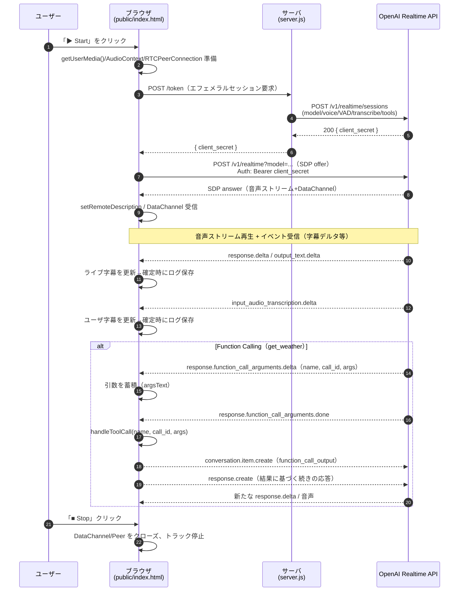
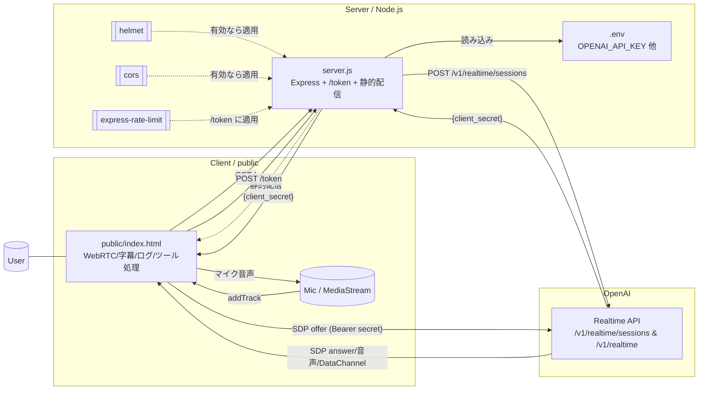

# Realtime Voice (WebRTC) + Function Calling Demo

ブラウザからマイク音声を WebRTC で OpenAI Realtime API に送り、AI の音声・テキスト返答をリアルタイムに受け取るデモです。字幕のライブ表示、確定ログの保存、簡易ツール呼び出し（Function Calling）を実装しています。さらに、軽量な音声感情推定（prosody指標+テキストの簡易辞書）も追加しています。

## 主な機能
- リアルタイム会話: マイク入力→AI 音声/テキストを同時受信、右ペインで字幕・ログ表示
- Function Calling: `get_weather` ツールを実装（ダミー値で応答）
- 感情推定: `analyze_emotion` ツール（クライアントでRMS/基本周波数/発話速度を推定し、サーバでヒューリスティック分類）
- ログ管理: 会話履歴を `localStorage` に自動保存、JSON でエクスポート
- 音声アバター: 受信音声の簡易 VAD で「話している」アニメーション
- セッション発行: バックエンドが OpenAI へエフェメラルセッションを発行（API Key はクライアントに渡さない）

## ディレクトリ構成
- `server.js`: Express サーバ。`/token` で Realtime セッションを作成し、`public/` を静的配信
  - `POST /emotion/analyze`: 感情推定エンドポイント（軽量ヒューリスティック）
- `public/index.html`: Web クライアント。WebRTC 接続、字幕/ログ UI、ツール処理など
- `.env`: 環境変数（API キーなど）。`.gitignore` 済み

## 動作要件
- Node.js 18+（または 20+ 推奨）
- 最新ブラウザ（WebRTC とマイク権限が必要）
- OpenAI API Key（環境変数で設定）

## セットアップ
1) 依存関係をインストール

```bash
npm install
```

2) `.env` を作成し、少なくとも以下を設定

```env
OPENAI_API_KEY=sk-...   # あなたの API Key（公開・共有厳禁）
PORT=3000               # 任意。未設定なら 3000

# 省略可（未設定時は既定値）
REALTIME_MODEL=gpt-realtime        # 旧: gpt-4o-realtime-preview でも可
REALTIME_VOICE=alloy               # 音声ボイス
TRANSCRIBE_MODEL=gpt-4o-transcribe # 音声文字起こし
TURN_SILENCE_MS=700                # サーバ VAD の無音検出(ms)
CORS_ALLOW_ORIGIN=                 # 本番では許可ドメインをカンマ区切りで指定
```

3) サーバを起動

```bash
npm start
```

4) ブラウザでアクセス

```
http://localhost:3000
```

ページの「▶ Start」を押してマイク権限を許可すると会話を開始できます。右上「Export JSON」で会話履歴を保存できます。

## 仕組み（概要）
- バックエンド（`server.js`）
  - `POST /token`: OpenAI の `POST /v1/realtime/sessions` に対して、指定モデル・音声・VAD・文字起こし・Function Calling の設定をまとめて送信し、エフェメラルな `client_secret` を発行してクライアントへ返します。
  - `GET /healthz`: 簡単な疎通確認 (`{ ok: true, model: ... }`)。
  - 静的配信: `public/` 配下を配信。
  - `POST /emotion/analyze`: クライアントで推定した特徴量（RMS/基本周波数/発話速度）とテキストを受け取り、`primary/polarity/valence/arousal/confidence` を返却。
- フロントエンド（`public/index.html`）
  - WebRTC: `RTCPeerConnection` を作成し、`/token` でもらった `client_secret` を使って OpenAI Realtime と SDP 交換。
  - DataChannel: Realtime から届くイベントを処理し、テキストのデルタ表示・確定ログ化を行います。
  - Function Calling: Realtime からの関数引数デルタを受け取り、`get_weather`/`search_kb`/`analyze_emotion` を処理。ツール出力は `function_call_output` として会話に注入後、続きの応答を生成。
  - UI: ライブ字幕、ログ自動保存、JSON エクスポート、簡易 VAD 連動アバター。

### 感情推定（軽量）
- 目的: 一目で分かる感情指標を補助情報として返す（音声の覚醒度やテキストの極性を簡易推定）
- クライアント処理（`public/index.html`）
  - マイク解析: `AnalyserNode` から 100ms ごとに波形を取得し、以下を推定
    - `rms_mean`: 音量のRMS（0..~0.5前後）
    - `f0_mean`: 基本周波数（50..400Hzの自相関ベース推定）
    - `speech_rate`: 直近N秒の文字起こし増分から計算した文字/秒
  - ユーザ発話が「確定」する度に、直近2.5秒の特徴サマリを作成し、モデルに「必ず `analyze_emotion` を呼ぶ」よう `response.create` を送信
- サーバ処理（`server.js`）
  - `POST /emotion/analyze`: 受け取った特徴量とテキストから、以下を返却
    - `primary`: 代表ラベル（happy/excited, angry/frustrated, sad/tired, calm/neutral）
    - `polarity`: pos/neu/neg（valenceの符号から算出）
    - `valence`: -1..1（テキスト内のポジ/ネガ語の簡易辞書ヒット数から）
    - `arousal`: 0..1（主にRMS/基本周波数/話速の正規化合成）
    - `confidence`: 0..1（入力特徴の充実度と一貫性から算出）
    - `features`: エコーバック（`f0_mean`, `rms_mean`, `speech_rate`, `transcript`）
  - 注意: いずれもヒューリスティックであり、厳密な感情認識ではありません

#### API 仕様: `POST /emotion/analyze`
Request JSON 例:
```json
{
  "f0_mean": 150.0,
  "rms_mean": 0.12,
  "speech_rate": 3.2,
  "transcript": "ありがとう、助かりました。"
}
```
Response JSON 例:
```json
{
  "primary": "calm/neutral",
  "polarity": "pos",
  "valence": 0.33,
  "arousal": 0.41,
  "confidence": 0.72,
  "features": { "f0_mean": 150, "rms_mean": 0.12, "speech_rate": 3.2, "transcript": "..." }
}
```

#### ログ出力
- ツール出力JSONに加えて、読みやすい要約行を併記します（例）:
```
emotion: [POS] calm/neutral | v=0.33 a=0.41 c=0.72 | f0=150.0Hz rms=0.120 rate=3.20/s
tool_output: analyze_emotion -> { ...JSON... }
```

#### curl で試す
サーバ起動中に以下を実行してください。

```bash
# Neutral（中立・低覚醒）
curl -s -X POST http://localhost:3000/emotion/analyze \
  -H 'Content-Type: application/json' \
  -d '{"f0_mean":130,"rms_mean":0.06,"speech_rate":2.0,"transcript":"こんにちは、よろしくお願いします。"}' | jq

# Positive/Excited（ポジ・高覚醒）
curl -s -X POST http://localhost:3000/emotion/analyze \
  -H 'Content-Type: application/json' \
  -d '{"f0_mean":260,"rms_mean":0.28,"speech_rate":8.0,"transcript":"すごく嬉しい！最高！やった！"}' | jq

# Negative/Angry（ネガ・高覚醒）
curl -s -X POST http://localhost:3000/emotion/analyze \
  -H 'Content-Type: application/json' \
  -d '{"f0_mean":220,"rms_mean":0.26,"speech_rate":7.0,"transcript":"最悪だ。腹立つしイライラする。"}' | jq

# Negative/Sad（ネガ・低覚醒）
curl -s -X POST http://localhost:3000/emotion/analyze \
  -H 'Content-Type: application/json' \
  -d '{"f0_mean":110,"rms_mean":0.03,"speech_rate":1.2,"transcript":"疲れたし、悲しい気分です。"}' | jq
```

## Function Calling をカスタマイズ
- サーバ側ツール定義: `server.js` の `/token` で `tools` に関数仕様（名前・引数）を定義します。
- クライアント実装: `public/index.html` の `handleToolCall(name, callId, args)` にツールの実処理を実装します。
  - 実運用ではクライアントから直接外部 API を叩かず、サーバ経由にするなどセキュリティ配慮を推奨。

### 追加済みツールの例
- `get_weather(city, unit?)`: ダミーの天気応答
- `search_kb(query, top_k?)`: ローカルKBから簡易検索
- `analyze_emotion(f0_mean?, rms_mean?, speech_rate?, transcript?)`: 音声特徴とテキストから感情を推定
  - 備考: 本実装では「ユーザの各発話が確定するたびに必ず1回呼ぶ」よう初期/セッション指示で強制しています

無効化したい場合:
- `public/index.html` の「ユーザ発話確定時に `response.create` を送信する部分」をコメントアウト
- `server.js` のセッション `instructions` から `analyze_emotion` の必須呼び出し文面を削除

## RAG（検索拡張生成）の最小実装
- 追加ツール: `search_kb`（引数: `query`, `top_k`）。モデルが必要に応じて呼び出します。
- サーバ: `POST /rag/search` で簡易キーワード検索を実装。`kb/sample_kb.json` のローカル KB を対象にスコアリングして上位件を返します。
- クライアント: `handleToolCall()` に `search_kb` を実装し、結果を `function_call_output` として会話に注入後、続きの応答を生成します。

注意: 現状はキーワード検索の簡易版です。実運用ではドキュメントの埋め込み作成→ベクタ DB（例: Qdrant/Weaviate/Pinecone/pgvector/Chroma 等）での類似検索に差し替えてください。

## よくあるカスタマイズ
- モデル/音声の変更: `.env` の `REALTIME_MODEL`, `REALTIME_VOICE` を変更。
- 返答スタイル: 接続直後に送信する初期 `response.create` の `instructions` を編集（`public/index.html` 内）。
- 感情推定の調整: 閾値・正規化係数・辞書語彙を `server.js` の `/emotion/analyze` 実装内で調整。
- アバター: `public/avatar-talking.mp4` や poster 画像を差し替え。
- CORS/セキュリティ: 本番では `CORS_ALLOW_ORIGIN` を正確に設定。`helmet`, `cors`, `express-rate-limit` を導入可能（未インストールでも動作）。

## トラブルシュート
- 401/403 になる: `OPENAI_API_KEY` が正しいか、請求設定や Realtime Beta の利用条件を満たしているかを確認。
- 音が出ない/マイクが拾わない: ブラウザの権限、ミュート、HTTPS 環境（必要な場合）を確認。デベロッパーツールのコンソール/ネットワークログも参照。
- 接続が安定しない: 企業ネットワーク/ファイアウォールの影響や STUN/TURN サーバ設定を確認（本デモは Google STUN を使用）。
- Unknown tool が出る: ブラウザキャッシュの古いJSが読まれている可能性。ハードリロード（Shift+Cmd+R / Ctrl+F5）とサーバ再起動を実施。ツール名の正規化は実装済み（`public/index.html`）。

## セキュリティ注意
- `.env` は機密情報を含むため、必ずバージョン管理から除外（このリポジトリは `.gitignore` 済み）。
- API Key をクライアントへ直接配布しないため、必ず `/token` を経由してエフェメラルセッションを取得します。
- プライバシー/同意: 感情推定は補助目的で不確実性があります。実運用ではオプトイン/明示表示、データ保持方針の策定を推奨します。

## スクリプト
- `npm start`: 開発サーバを起動（`server.js`）

---
何か拡張（追加ツール、UI 改良、録音保存、TURN 導入など）をご希望でしたら、遠慮なくお知らせください。

## 動作フロー（シーケンス）


## ファイル／依存関係

